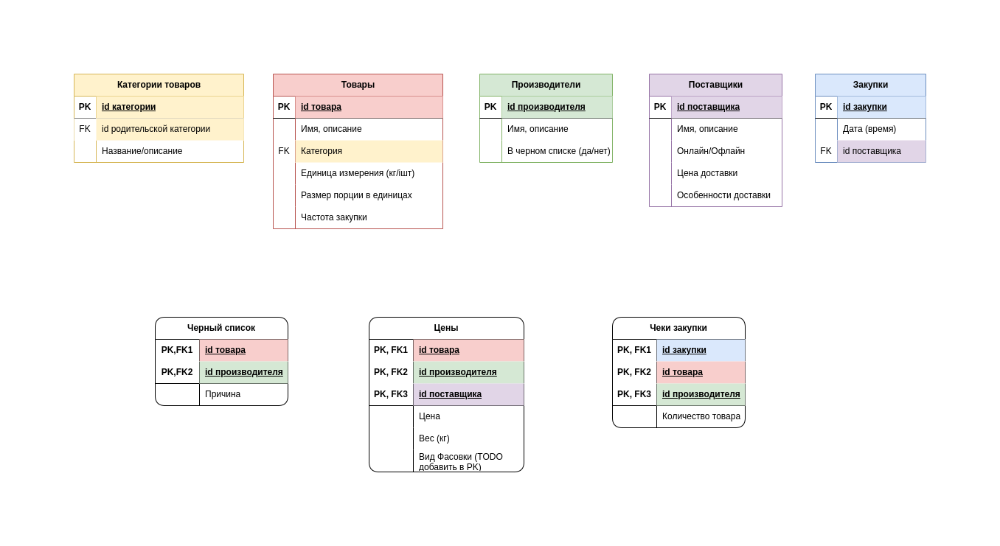

# Приложение закупок

## Основной функционал
### С точки зрения товаров
1. Хранение ассортимента всех закупаемых когда-либо товаров.
2. Удобное хранение и обновление цен товаров для разных поставщиков и производителей, автоматическое вычисление самой выгодной цены.
3. Ведение черного списка производителей для товаров (тех, которых забраковали либо мы, либо беженцы).
4. Просмотр всех закупок, в которых присутствовал товар (даты последней закупки, календаря закупок по товару и т. д.).
### С точки зрения закупок
1. Хранение информации о всех закупках (поставщик, дата, чек закупки, список товаров, производителей, фактические цены).
2. Автоматическое создание драфта закупки исходя из ротации товаров, целевого количества продуктовых наборов и т. д.
3. Ручная правка и сохранение закупки исходя из фактического чека закупки, обновление цен товаров, участвоваших в закупке на фактические.

## Схема хранения данных

Поскольку отношений довольно много, вместо того, чтобы рисовать их стрелочками, отметил цветами.

## Сущности

### Товар

Продукцию разных производителей мы считаем одним и тем же товаром, если она полностью взаимозаменяема (т.е. вряд ли кто-то на вкус заметит разницу).

Примеры: 
- Кукуруза Bonduelle и Кукуруза TopSun - это один и тот же товар "Кукуруза" с несколькими производителями;
- Печенье Юбилейное и Печенье Oreo - разные товары, у каждого из которых может существовать единственный производитель.

#### Страница товара

*Атрибуты*:
- id
- Название / описание
- Ссылка на категорию
- Единица измерения товара (кг, шт)
- Размер одной порции единиц
- Частота закупки
- Остаток порций на складе (подтянуть из складского приложения по id товара)
- Ссылка на таблицу цен для товара (из таблицы "Цены" по id товара)
- Минимальная цена, поставщик с минимальной ценой, производитель с минимальной ценой и т. д. (из таблицы "Цены" по id товара, с учетом таблицы "Черный список")
- Черный список производителей (из таблицы "Черный список", по id товара)
- Дата последней закупки (из таблицы "Чеки закупки", по id товара)
- Ссылка на список закупок с участием товара (из таблицы "Чеки закупки", по id товара).

*Функционал*:
- Удалить товар
- Обновить состояние товара, в частности:
    
    Обновления:
    - любых полей таблицы "Товары" кроме id;
    - Добавление новой цены для определенного производителя и поставщика -> должны обновиться минимальная цена и поставщик и производитель с минимальной ценой.

        При отсутствии нужного поставщика или производителя нужно предоставить ссылку на страницы [создание нового поставщика](#создание-нового-поставщика) или [создание нового производителя](#создание-нового-производителя).
    - добавление производителя в черный список -> должны обновиться минимальная цена, производитель и поставщик.

#### Создание нового товара

Добавляет новый товар в таблицу "Товары" с указанными атрибутами.

*Атрибуты*:
- название/описание
- категория (из таблицы "Категории")
- единица измерения (кг/шт)
- размер одной порции в единицах
- Частота закупки

Если требуемой категории еще нет, нужно предоставить ссылку на [страницу](#создание-новой-категории) создания новой категории.

### Категория товара

Создает иерархическую структуру всех товаров. Самые маленькие (листовые) категории являются группами ротации. Внутри них происходит смена товара от закупки к закупке.

#### Страница категории

*Атрибуты*:
- Название / описание
- Ссылка на страницу родительской категории
- Ссылки на страницы дочерние категории / товаров

#### Создание новой категории

Добавляет новую категорию в таблицу "Категории" с указанными атрибутами.

*Атрибуты*:
- Название / описание
- Родительская категория (из таблицы "Категории")

### Закупка

Хранит информацию об одной закупке у конкретного поставщика.

#### Страница закупки

*Атрибуты*:
1. id закупки
2. дата (время)
3. id поставщика
4. таблица чека (из таблицы "Чеки закупки" + "Товары" + "Производители" + "Цены")

    Колонки:
    - название товара
    - название производителя
    - количество единиц товара
    - цена за единицу
    - общая цена за товар
5. стомиость без учета доставки (просто сумма по предыдущей таблице)
6. стоимость доставки (Из таблицы "Поставщики" по id поставщика)
7. стоимость с доставкой (сумма двух предыдущих пунктов)

*Функционал*:
- Удалить закупку.
- Редактировать закупку.
- Выгрузка в excel (или еще куда).

#### Создание новой закупки

- Добавляет новую закупку в таблицу "Закупки".
- Добавляет группу строк в таблицу "Чеки закупки" c id закупки.
- Обновляет строки в таблице "Цены" в соответствии с фактическими ценами закупки.

Этапы:
1. Ввод требуемого количества продуктовых наборов и поставщика.
2. Автоматическое создание драфта закупки (списка товаров, их количества, производителей, цен) на основе правил ротации, оптимальных цен и (в будущем) остатков на складе.
3. Правка закупки исходя из реального чека.
4. Сохранение закупки.

### Поставщик

Содержит информацию о поставщиках, стоимости и условиях доставки и т. д.

#### Страница поставщика

*Атрибуты*:
- id
- Имя/Описание
- онлайн/офлайн
- цена доставки
- особенности доставки
- таблица всех закупок, с участием поставщика (из таблицы "Закупки" по id поставщика).

*Функционал*:
- Обновление любых полей таблицы "Поставщики" кроме id;
- Удаление поставщика.

#### Создание нового поставщика

Добавляет нового поставщика в таблицу "Поставщики" с указанными атрибутами.

Атрибуты:
- название/описание
- онлайн/офлайн
- цена доставки
- особенности доставки

### Производитель

Содержит информацию о производителях. Могут быть занесены в черный список.

#### Страница производителя

*Атрибуты*:
- id
- имя/описание
- черный список (да/нет)
- таблица всех товаров, данного производителя (из таблицы "Цены" по id производителя).

*Функционал*:
- Обновление любых полей таблицы "Производители" кроме id;
- Удаление производителя.

#### Создание нового производителя

Добавляет нового производителя в таблицу "Производители" с указанными атрибутами.

*Атрибуты*:
- имя/описание
- черный список (да/нет)

## Интерфейс

### Вкладки

1. Общая структура приложения

    Здесь могут быть размещены:
    - дерево категорий товаров, навигация по [страницам категорий](#страница-категории);
    - закупки: (ссылка на таблицу "Закупки");
    - поставщики (ссылка на таблицу "Поставщики"), при желании можно вынести в отдельную вкладку;
    - производители (ссылка на таблицу "Производители"), при желании можно вынести в отдельную вкладку.

2. Таблица всех товаров

    Выводит таблицу всех добавленных товаров.

    *Функционал*:
    - [добавление нового товара](#создание-нового-товара)
    - поиск по товарам
    - переход на [страницу товара](#страница-товара) при нажатии на строку с ним в таблице.

3. Таблица всех закупок

    Выводит таблицу "Закупки".

    *Функционал*:
    - [создание новой закупки](#создание-новой-закупки)
    - переход на [страницу закупки](#страница-закупки) при нажатии на строку с ней в таблице.

